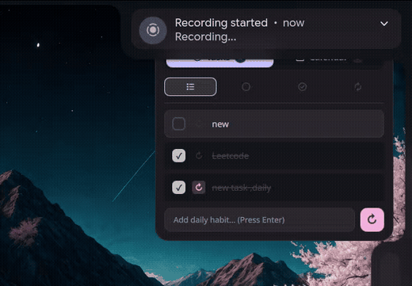

# Quickshell Premium Todo & Calendar Widget

A highly polished, fully animated, desktop-embedded Wayland widget for tracking tasks and calendar events seamlessly. Built for Hyprland and Quickshell with a native Catppuccin Mocha palette.

<p align="center">
  
</p>

## Features
- **Hold & Slide to Delete**: Native swipe gestures with red reveal and spring snapback animations.
- **Keyboard Fast**: Press Enter to instantly add tasks and calendar events.
- **Date & Time Picker**: Clickable trigger button opening an expandable inline drawer with upcoming date chips and time slots.
- **Dual Views & Icon Filters**:
  - **Tasks**: Filter by All, Active, Completed, or Daily recurring habits.
  - **Calendar**: Filter by Today, Upcoming, and All events with one-click Google Calendar sync.
- **Emerging Adaptive Card**: Smooth Caelestia-style spline transitions when resizing or expanding, paired with Wayland `Region` click-masking so clicks through unused areas pass directly to your desktop.
- **Wayland Native**: Runs on `WlrLayer.Bottom` directly on your desktop wallpaper behind active windows with zero-lag pointer handlers.
- **Catppuccin Styled**: Integrated Mocha tonal palette with Material Symbols Rounded icons.

## Requirements
- [Quickshell 0.3+](https://github.com/outfoxxed/quickshell)
- Python 3
- `Material Symbols Rounded` font installed on your system.

## Installation
```bash
git clone https://github.com/ziuus/caelestia-todo-widget.git
cd caelestia-todo-widget
./install.sh
```

## Usage
Run it via the quickshell CLI:
```bash
qs -p ~/.config/quickshell-todo-widget/TodoWidget.qml -d
```
You can add this command to your `hyprland.conf` or window manager autostart file to launch it on boot.

## Configuration
To sync a remote calendar, create `~/.local/state/calendar_config.json`:
```json
{
  "ics_url": "https://calendar.google.com/calendar/ical/..."
}
```
